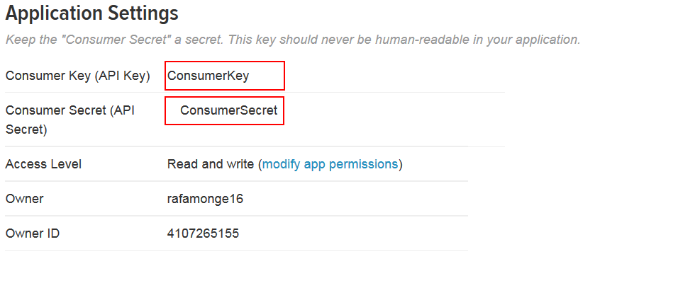
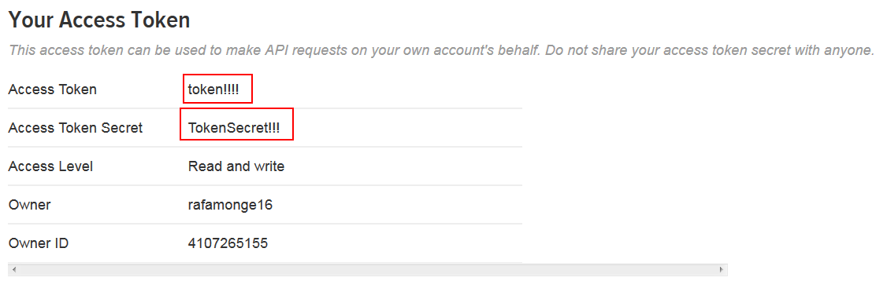
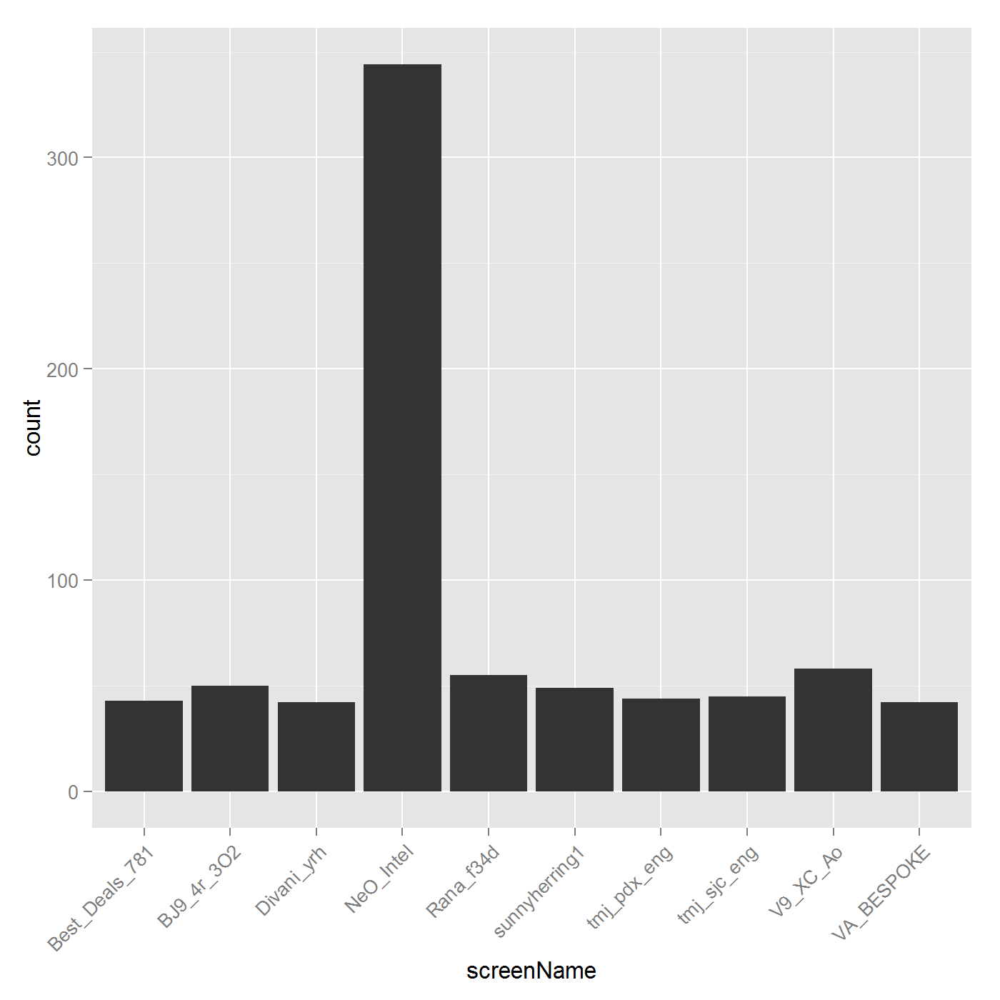
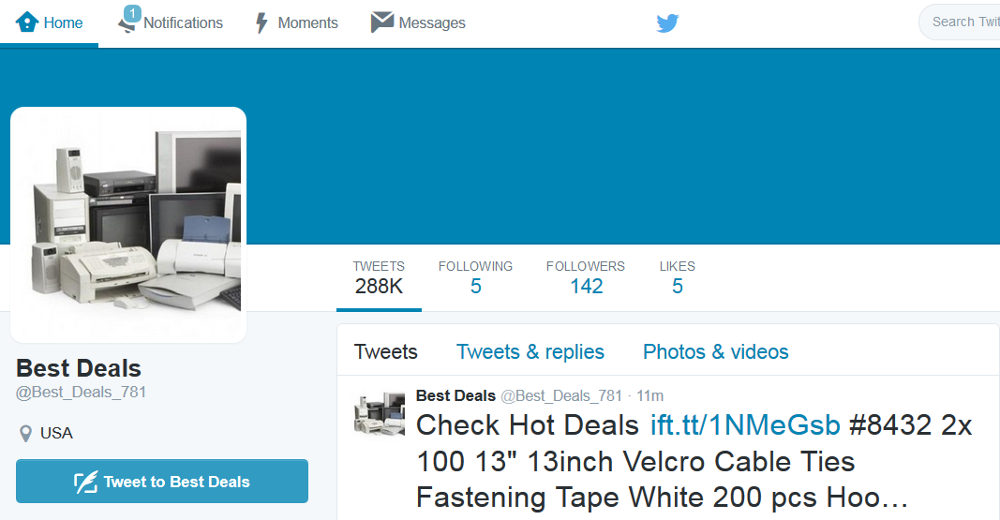
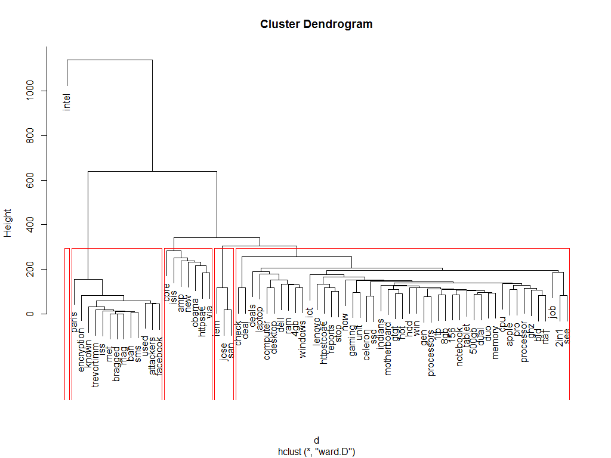
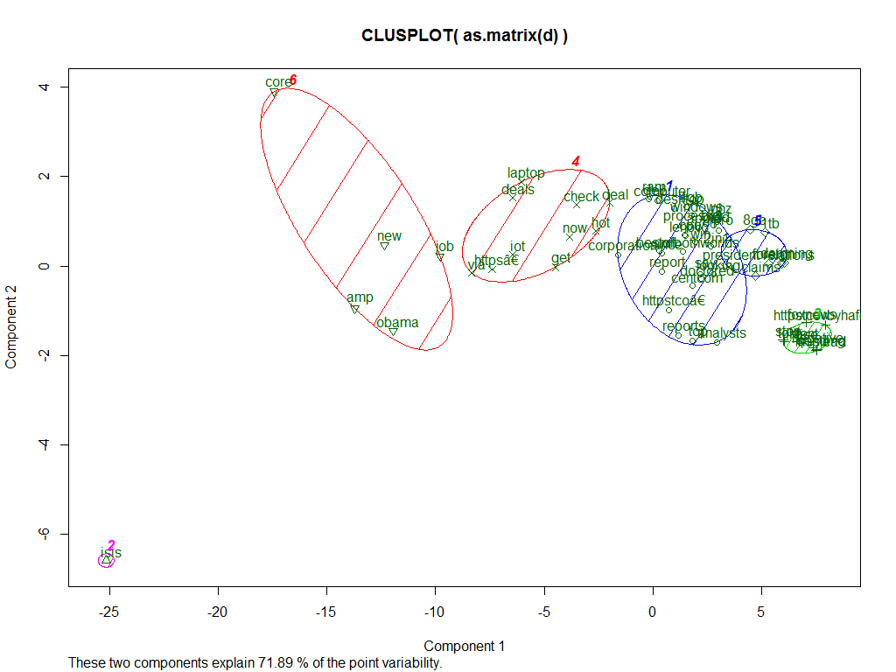
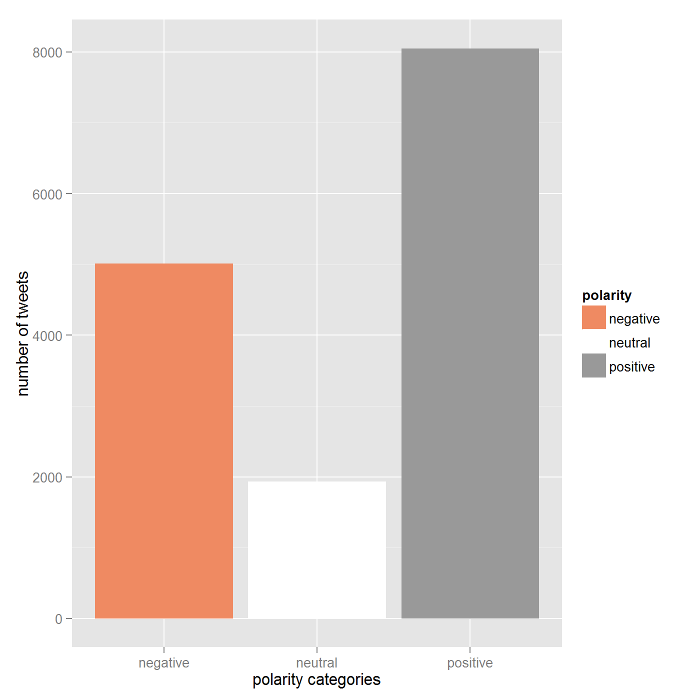
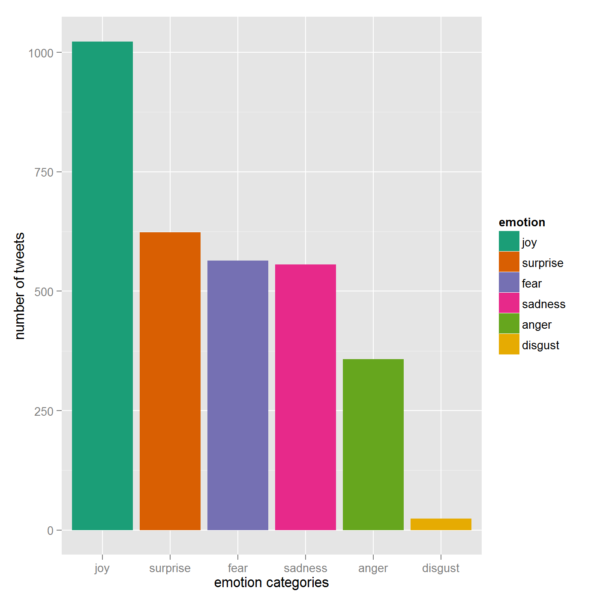

<style>
.small-code pre code {
  font-size: 1em;
}

.midcenter {
    position: fixed;
    top: 50%;
    left: 50%;
}

.reveal h1, .reveal h2, .reveal h3 {
  word-wrap: normal;
  -moz-hyphens: none;
}

</style>

Intro to extracting and analyzing twitter data
========================================================
author: Rafael Monge
date:   26-11-2015


Agenda
========================================================

- Requirements
- Twitter API
- Extracting Twitter data
- Building a corpus
- Clusters
- Sentiment Analysis


Requirements
========================================================
type: section

Tools used
========================================================

- R
- RStudio
- R libraries:
	- twitteR
	- tm
	- cluster
	- sentiment
	 
Accessing Twitter API
========================================================

1. Create a twitter account
2. Go to https://apps.twitter.com/app/new
3. Fill in the form sample values: Name = TwitterDemoForCOP, description = "test", website = "test.intel.com" and create the app.
4. Get/generate the access tokens.
5. You'll need several values for connecting to twitter.  
	-  Consumer Key (API Key)
	-  Consumer Secret (API Secret)
	-  Access Token
	-  Access Token Secret
	
Accessing Twitter API
========================================================



Accessing Twitter API
========================================================



Twitter API
========================================================
type: section

REST API
========================================================
- Get access to tweets, trends, user information etc.
- Can filter tweets by
  - Keyword: "beer -root", "Intel"
  - longitude/latitude
  - dates
  - users
  - language
  - etc.
- https://dev.twitter.com/rest/reference/get/search/tweets

Streaming API
========================================================
- Get a constant stream of  tweets as they are created
- Can filter by:
  - simple keywords
  - location
  - users

Rate limiting
========================================================
- Twitter limits the number of requests 
- 450 requests  / 15 min window for REST
- 1% of tweets for Streaming API
- Can always pay for more tweets :)

Extracting Tweets using R  
========================================================
type: section

using twitteR library

Extracting Tweets using R  
========================================================
class: small-code


```r
consumerKey <- "consumer!!"
consumerSecret <- "consumerSecret!"
accessToken <- "token!!"
accessSecret <- "secret!!"

setup_twitter_oauth(consumerKey, consumerSecret, accessToken, accessSecret)
intelTweets <- searchTwitter("Intel", n=15000, lang="en")
tweets <- twListToDF(intelTweets)
```


What have we got?
========================================================
class: small-code


16 columns:

```
 [1] "text"          "favorited"     "favoriteCount" "replyToSN"    
 [5] "created"       "truncated"     "replyToSID"    "id"           
 [9] "replyToUID"    "statusSource"  "screenName"    "retweetCount" 
[13] "isRetweet"     "retweeted"     "longitude"     "latitude"     
```


What have we got?
========================================================


```r
(tweets[2:5,1]) ## get some tweets
```

```
[1] "Check out this Great Deal : https://t.co/vwbgCVi91h #2817 #8718 DELL OPTIPLEX DESKTOP ~ INTEL CORE 2 DUO 3.0GHz ~ … https://t.co/CFYH2sALRq" 
[2] "Intel Chief says the #Tablet #Market is a declining #Business https://t.co/saetHbbXcx"                                                       
[3] "Intel Assigned “AA” Credit Rating by Morningstar (INTC) https://t.co/LL2a08xdTv"                                                             
[4] "RT @shaneharris: New: CENTCOM analysts allege their bosses deleted emails, documents to cover up cooking intel on ISIS. https://t.co/LwDJ7L…"
```


Posts by User
========================================================



Who are they?
========================================================


Who are they?
========================================================



Building a Corpus
========================================================
type: section

using tm library


What's a corpus?
========================================================
class: small-code


- Collection of texts and metadata
- Different formats
- Applies common operations regardless of format
- Used to clean tweets
  - Lower case
  - remove punctuation
  - remove stop words
    
    ```
    [1] "i"      "me"     "my"     "myself" "we"    
    ```
  - stem words

Transformed Text
========================================================
class: small-code

Raw Tweets

```
[1] "Check out this Great Deal : https://t.co/vwbgCVi91h #2817 #8718 DELL OPTIPLEX DESKTOP ~ INTEL CORE 2 DUO 3.0GHz ~ … https://t.co/CFYH2sALRq"
[2] "Intel Chief says the #Tablet #Market is a declining #Business https://t.co/saetHbbXcx"                                                      
```

Transformed tweets

```
[1] "check   great deal httpstcovwbgcvi91h 2817 8718 dell optiplex desktop intel core 2 duo 30ghz †httpstcocfyh2salrq"
[2] "intel chief says  tablet market   declining business httpstcosaethbbxcx"                                           
```

Terms Matrix
========================================================
class: small-code


```r
commonTermsDf[1:5, 1:4]
```

```
         character(0) character(0).1 character(0).2 character(0).3
amp                 0              0              0              0
analysts            0              0              0              0
check               0              1              0              0
core                0              1              0              0
deal                0              1              0              0
```

Clustering
========================================================
type: section

Hierarchical Cluster
========================================================
class: small-code


1. Each tweets starts on its own cluster/group
2. Calculate distance between tweets (Tweets with common word counts will be closer)
3. Find the 2 closest clusters and merge them into a single cluster
4. Compute distances (similarities) between the new cluster and each of the old clusters.
5. Repeat steps 3 and 4 until there's only one cluster.


  

  
Hierarchical Cluster - plot
========================================================



Kmeans Cluster
========================================================
1. Define K initial points (centroids).
2. Calculate distance of all data points to the centroids and define which one they are closer to
3. Redefine the centroids as the mean of data points closest to them
4. Repeat until the centroids don't change


kmeans plot
========================================================
class: small-code


```r
kplot<- clusplot(as.matrix(d), kfit$cluster)  
plot(kplot)
```



sentiment analysis
========================================================
type: section


polarity plot
========================================================


emotion plot 
========================================================


How? (simplified version)
========================================================
- 3 categories: Positive, Negative, Neutral
- Database of tweets that have already been classified into those categories
- Tweet : "I love good food" 
- Split by words

How? (simplified version)
========================================================
- Food is found on 250 times in positive tweets
- Number of words on positive tweets: 1000
- P(Food|Positive) = 250/ 1000 = 25%
- I Love good food
- 25% * 62% * 74% * 25% = 0.03
- That's the Probability of the tweet being positive.
- Do the same for negative and neutral. Choose the category with the highest probability.


Making this real
========================================================
- Lots of data (too much for R)
- Stored tweets in hadoop
  - consumed thorugh kafkka
  - processed by spark 

Questions?  
========================================================
